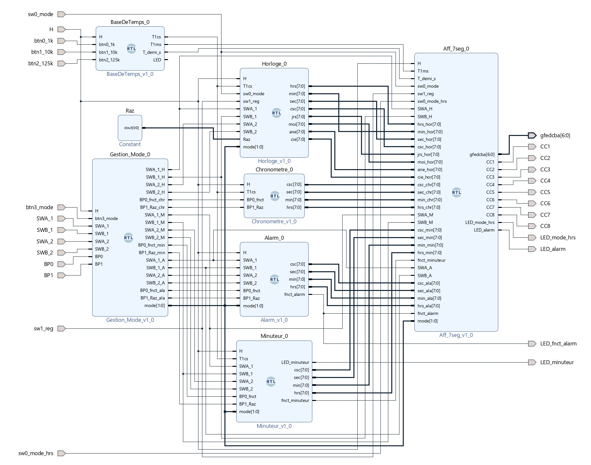

# Horloge Digitale — VHDL Project

## Presentation Link

Check out the project presentation and design overview here:  
[Horloge Digitale Presentation on Canva](https://www.canva.com/design/DAGjkuY9CuU/3aqjEsbIg8dohLzr9mm8pg/edit)

## Description

This project is a fully-featured digital clock system designed in **VHDL** as part of the **ELE401** course. It runs on the **Zybo Z7-20 FPGA board** using a base clock of **125 MHz**, and features:

- Real-time clock and date display
- Stopwatch
- Countdown timer
- Alarm with configuration
- Setup mode using encoders
- Leap year management
- 12h/24h display format switching
- Multiplexed 8-digit 7-segment display output

All features are synchronized and integrated into a modular architecture using Vivado.

---

## System Architecture Diagram

The following diagram provides a high-level overview of the digital clock system and its main components, showing how they interact in real-time on the Zybo Z7-20 FPGA board:



## Features

### Time & Calendar Display

- Displays **hours, minutes, seconds, and centiseconds**
- Supports **calendar mode**: shows **day, month, and year**
- Leap year logic for accurate day/month handling
- **12h/24h mode** selection via switch
  - **PM indicator LED** lights up in 12h PM mode

### Setup Mode

- Activated with a hardware switch
- Allows user to configure:
  - Clock time
  - Date
  - Alarm
  - Timer
- **Two encoders** used for:
  - Increment
  - Decrement
- In setup mode:
  - **Two digits blink** to indicate active counter
  - Setup logic applies across all modes (clock, alarm, timer)

### Stopwatch

- Resolution up to **centiseconds**
- Start, pause, reset features
- Controlled via shared interface

### Timer

- Countdown with user-configured time
- LED turns on when timer expires
- Remains on until reset manually

### Alarm

- Active LED when alarm is set
- Another LED lights up while alarm rings
- Alarm must be turned off manually

---

## Display System: `Afficheur` Component

The **`Afficheur`** module handles **everything shown on the 7-segment display**. It is central to the user interface and display logic. Key roles include:

- **Digit multiplexing**:
  - Refreshes each of the 8 digits every **1 ms** (from a 1 kHz base clock)
- **Mode-sensitive content**:
  - Displays **clock time**, **date**, **stopwatch**, **timer**, or **alarm**
  - Dynamically selects the values to be shown based on the current mode
- **12h/24h display logic**:
  - Handles conversion of internal time representation for user display
  - Adds PM LED feedback when applicable
- **Blinking selection during setup**:
  - Active digit pairs are blanked or alternated at **0.5 Hz**
- **Encoder feedback**:
  - Reacts to encoder updates in setup mode to update displayed values in real time

This module ensures that the system remains user-friendly and clear regardless of the active mode.

---

## Architecture Overview

The system is composed of the following key VHDL modules:

| Module              | Description |
|---------------------|-------------|
| `Horloge.vhd`       | Real-time clock counter |
| `Chronomètre.vhd`   | Stopwatch logic |
| `Minuteur.vhd`      | Countdown timer |
| `Alarm.vhd`         | Alarm comparator |
| `BaseDeTemps.vhd`   | Clock dividers: generates 1 ms, 1 cs, 0.5 Hz, etc. from 125 MHz |
| `DiviseurN.vhd`     | Multiplexer-based divider |
| `Aff_7seg.vhd`      | Core logic for 7-segment output (`Afficheur`) |
| `Gestion_Mode.vhd`  | Input multiplexer for shared interface across modes |
| `cptMN.vhd`         | Modular counter with leap year logic |

> `Gestion_Mode.vhd` is **not an FSM**. It acts as a **multiplexer**, selecting signal paths based on the active mode.  
> `DiviseurN.vhd` is also a **selector** for derived frequencies.

---

## Simulation & Testbenches

Testbenches for individual components are located in:

`Horloge_ELE401.srcs/sim_1/new/`

Available testbenches:

- `TB_Horloge.vhd`
- `TB_Alarm.vhd`
- `TB_Minuteur.vhd`
- `TB_chrono.vhd`
- `TB_Gestion_Mode.vhd`
- `TB_cptMN.vhd`

Vivado waveform (`.wcfg`) files are provided for visual simulation.

---

## File Structure

All major design files are inside the project directory:

```plaintext
Horloge_ELE401.srcs/
├── sources_1/new/     ← VHDL source components (design modules)
├── sim_1/new/         ← VHDL testbenches for simulation
└── constrs_1/new/     ← FPGA constraints file (.xdc) for Zybo Z7-20
